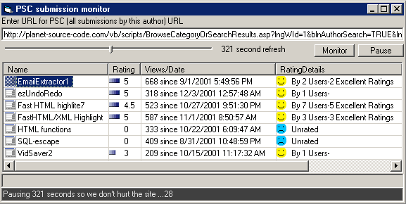



## PSCmonitor

### Description

Monitor your submissions on PSC.

This code will let you know when someone votes for one of your programs.

Demonstrates:

1. Using the listview

2. Parsing HTML using regular expressions

3. Writing ini file - includes easy to use ini.bat

and more.

If you like this code, PLEASE VOTE.

Note: although it is cool to set the refresh very low, doing so puts unneeded stress on PSC.

If you use this app often please set the refresh

to the highest setting.
 
### More Info
 
I ended up using the DHTML edit control to get the HTML. Using the inet control didn't work since PSC monitors for this. I tried using the Webbrowser control, but obtaining the source code from DOM is difficult since the documentcomplete event fires everytime a frame or embed finishes loading. Anyway, I know it seems weird but this method seemed to work by far the best.

             |
---                |---
**Submitted On**   |2001-12-10 14:19:18
**By**             |[RegX](https://github.com/Planet-Source-Code/PSCIndex/blob/master/ByAuthor/regx.md)
**Level**          |Intermediate
**User Rating**    |4.9 (49 globes from 10 users)
**Compatibility**  |VB 6\.0
**Category**       |[Complete Applications](https://github.com/Planet-Source-Code/PSCIndex/blob/master/ByCategory/complete-applications__1-27.md)
**World**          |[Visual Basic](https://github.com/Planet-Source-Code/PSCIndex/blob/master/ByWorld/visual-basic.md)
**Archive File**   |[PSCmonitor4094012102001\.zip](https://github.com/Planet-Source-Code/regx-pscmonitor__1-29507/archive/master.zip)

### API Declarations

need reference to regular expression 5.5

